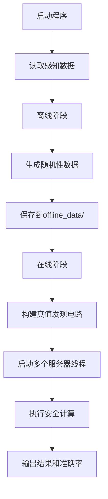

# FPTD 项目运行指南

## 项目概述

FPTD（Fast Privacy-Preserving and Reliable Truth Discovery）是一个基于安全多方计算的隐私保护真值发现系统，用于众感数据融合。

## 系统要求

- **Java版本**: JDK 17 或更高版本
- **操作系统**: macOS / Linux / Windows
- **内存**: 建议 4GB 以上

## 项目结构

```
FPTD-main/
├── src/
│   ├── main/java/fptd/          # 主程序代码
│   │   ├── Main.java            # 程序入口
│   │   ├── Params.java          # 配置参数
│   │   ├── EdgeServer.java      # 边缘服务器
│   │   ├── ServerThread.java    # 服务器线程
│   │   ├── protocols/           # 在线协议实现
│   │   ├── offline/             # 离线协议实现
│   │   ├── sharing/             # 秘密共享实现
│   │   ├── truthDiscovery/      # 真值发现算法
│   │   └── utils/               # 工具类
│   └── test/java/               # 测试代码
├── datasets/                    # 数据集
│   └── weather/                 # 天气数据集
├── offline_data/                # 离线阶段生成的数据
└── README.md                    # 项目说明
```

## 编译和运行步骤

### 方法一：使用命令行编译

#### 1. 编译项目

```bash
# 进入项目根目录
cd FPTD-main

# 创建输出目录
mkdir -p out

# 编译主程序
javac -d out -sourcepath src/main/java src/main/java/fptd/Main.java

# 编译测试程序（需要JUnit库）
javac -d out -sourcepath src/test/java -cp out:junit-4.13.2.jar:hamcrest-core-1.3.jar src/test/java/online/*.java src/test/java/offline/*.java
```

#### 2. 运行主程序

```bash
# 运行FPTD主程序
java -cp out fptd.Main
```

#### 3. 运行测试

```bash
# 运行在线测试
java -cp out:junit-4.13.2.jar:hamcrest-core-1.3.jar org.junit.runner.JUnitCore fptd.online.TestAdditionCircuit

# 运行离线测试
java -cp out:junit-4.13.2.jar:hamcrest-core-1.3.jar org.junit.runner.JUnitCore fptd.offline.TestAdditionOffline
```

### 方法二：使用IDE（推荐）

#### IntelliJ IDEA

1. 打开 IntelliJ IDEA
2. 选择 `File` → `Open`，选择项目根目录
3. 等待项目索引完成
4. 右键点击 `src/main/java/fptd/Main.java` → `Run 'Main.main()'`

#### Eclipse

1. 打开 Eclipse
2. 选择 `File` → `Import` → `General` → `Existing Projects into Workspace`
3. 选择项目根目录
4. 右键点击 `Main.java` → `Run As` → `Java Application`

#### VS Code

1. 打开 VS Code
2. 打开项目文件夹
3. 安装 "Java Extension Pack" 扩展
4. 点击 `Main.java` 中的 `main` 方法，按 `F5` 运行

## 配置参数说明

主要配置参数在 [`Params.java`](src/main/java/fptd/Params.java) 文件中：

| 参数 | 默认值 | 说明 |
|------|--------|------|
| `NUM_SERVER` | 7 | 参与计算的服务器数量 |
| `ITER_TD` | 3 | 真值发现迭代次数 |
| `IS_PRINT_EXE_INFO` | true | 是否打印执行信息 |
| `sensingDataFile` | datasets/weather/answer.csv | 感知数据文件路径 |
| `truthFile` | datasets/weather/truth.csv | 真值数据文件路径 |
| `isCategoricalData` | false | 是否为分类数据 |

### 修改数据集

在 [`Params.java`](src/main/java/fptd/Params.java:35-37) 中修改：

```java
// 天气数据集（数值型）
public final static String sensingDataFile = "datasets/weather/answer.csv";
public final static String truthFile = "datasets/weather/truth.csv";
public final static boolean isCategoricalData = false;
```

## 运行流程



## 常见问题

### Q1: 编译时提示"找不到符号"

**解决方案**: 确保使用 JDK 17 或更高版本：

```bash
java -version
javac -version
```

### Q2: 运行时提示"找不到主类"

**解决方案**: 确保在项目根目录下运行，并正确设置 classpath：

```bash
java -cp out fptd.Main
```

### Q3: 如何切换数据集？

**解决方案**: 修改 [`Params.java`](src/main/java/fptd/Params.java:27-37) 中的数据集配置，取消注释对应的数据集：

```java
// 鸭子识别数据集（分类数据）
// public final static String sensingDataFile = "datasets/d_Duck_Identification/answer.csv";
// public final static String truthFile = "datasets/d_Duck_Identification/truth.csv";
// public final static boolean isCategoricalData = true;

// 天气数据集（数值型）
public final static String sensingDataFile = "datasets/weather/answer.csv";
public final static String truthFile = "datasets/weather/truth.csv";
public final static boolean isCategoricalData = false;
```

### Q4: 离线数据已经存在，是否需要重新生成？

**说明**: 如果修改了 `NUM_SERVER` 参数，需要删除 `offline_data/` 目录下的旧文件，程序会重新生成。

### Q5: 如何查看详细的执行过程？

**解决方案**: 确保 [`Params.java`](src/main/java/fptd/Params.java:7) 中的 `IS_PRINT_EXE_INFO` 设置为 `true`：

```java
public static final boolean IS_PRINT_EXE_INFO = true;
```

## 输出结果说明

程序运行后会输出：

1. **执行信息**: 各阶段的执行状态
2. **预测真值**: 每个考试的预测真值
3. **权重信息**: 各工人的权重
4. **准确率**: 预测真值与真实值的对比准确率（RMSE）

## 添加外部库函数

由于本项目当前采用手动编译和管理依赖的方式，添加外部库函数需要以下步骤：

1.  **下载 JAR 文件**: 从 Maven Central、JCenter 或其他官方源下载所需库的 `.jar` 文件。例如，如果您需要添加 `org.json` 库，可以从 [mvnrepository.com](https://mvnrepository.com/artifact/org.json/json) 下载。
2.  **创建 `lib` 目录**: 在项目根目录下创建一个 `lib` 目录（如果不存在）：

    ```bash
    mkdir lib
    ```

3.  **放置 JAR 文件**: 将下载的 `.jar` 文件复制到新创建的 `lib` 目录中。

4.  **更新编译命令**: 在命令行编译时，您需要将新添加的 JAR 文件添加到 `classpath` 中。例如，如果添加了 `your-library.jar`：

    ```bash
    # 编译主程序
    javac -d out -sourcepath src/main/java -cp lib/your-library.jar src/main/java/fptd/Main.java

    # 编译测试程序
    javac -d out -sourcepath src/test/java -cp out:lib/your-library.jar:junit-4.13.2.jar:hamcrest-core-1.3.jar src/test/java/online/*.java src/test/java/offline/*.java
    ```

    **注意**: 如果有多个 JAR 文件，可以使用 `:`（Linux/macOS）或 `;`（Windows）分隔它们。

5.  **更新运行命令**: 在命令行运行时，也需要将 JAR 文件添加到 `classpath` 中：

    ```bash
    java -cp out:lib/your-library.jar fptd.Main
    ```

6.  **IDE 配置**: 如果使用 IDE，您需要将新添加的 JAR 文件作为外部库添加到项目的构建路径中。具体操作会因 IDE 而异：
    *   **IntelliJ IDEA**: `File` -> `Project Structure` -> `Libraries` -> `+` -> `Java`，然后选择 `lib` 目录下的 JAR 文件。
    *   **Eclipse**: `Project` -> `Properties` -> `Java Build Path` -> `Libraries` -> `Add JARs...` 或 `Add External JARs...`。
    *   **VS Code**: 在 `.vscode/settings.json` 中配置 `java.project.referencedLibraries`。例如：

        ```json
        {
            "java.project.referencedLibraries": [
                "lib/**/*.jar",
                "/path/to/other/library.jar"
            ]
        }
        ```

## 技术支持

如有问题，请参考项目根目录下的 `README.md` 和 `README_CN.md` 文件。
